# 3. Functional Requirements

Обозначения приоритета: 🟢 MUST · 🟡 SHOULD · 🔵 MAY.

---

## 3.1 Авторизация и пользователи

| ID | Требование | Приоритет |
|----|-----------|-----------|
| FR-AUTH-1 | Регистрация по email + пароль. | 🟢 |
| FR-AUTH-2 | Подтверждение email через ссылку. | 🟢 |
| FR-AUTH-3 | Вход по email/паролю с выдачей JWT (access + refresh). | 🟢 |
| FR-AUTH-4 | Сброс пароля по email. | 🟢 |
| FR-AUTH-5 | OAuth‑вход (Google) | 🟡 |
| FR-AUTH-6 | Привязка Telegram‑аккаунта через одноразовый код. | 🟢 |
| FR-AUTH-7 | Роли: user / premium / admin / super_admin. | 🟢 |
| FR-AUTH-8 | 2FA (TOTP) для админов. | 🟡 |
| FR-AUTH-9 | Хранение паролей через Argon2id. | 🟢 |

## 3.2 Поисковые профили и фильтры

Пользователь создаёт **поисковые профили** (Search Profiles). Каждый профиль — независимый набор фильтров с собственными уведомлениями.

### 3.2.1 Поддерживаемые фильтры

| Категория | Параметр | Тип | Пример |
|-----------|----------|-----|--------|
| **Локация** | Город (`city`) | string | `Berlin` |
| | Земля (`bundesland`) | enum (16 земель) | `Berlin` |
| | Почтовый индекс (`postal_code`) | string (PLZ) | `10115` |
| | Радиус (`radius_km`) | int | `10` |
| | Геоточка центра (`lat`,`lng`) | float | для радиусного поиска |
| **Стоимость** | Мин. цена (`price_min`) | int (€) | `500` |
| | Макс. цена (`price_max`) | int (€) | `1500` |
| | Тип цены (`price_type`) | enum: `cold`(Kaltmiete)/`warm`(Warmmiete)/`purchase` | `warm` |
| **Площадь** | Мин. площадь (`area_min`) | float (м²) | `45` |
| | Макс. площадь (`area_max`) | float (м²) | `90` |
| **Комнаты** | Мин. комнат (`rooms_min`) | float | `2` |
| | Макс. комнат (`rooms_max`) | float | `3.5` |
| **Доп. параметры (boolean)** | Балкон (`balcony`) | bool | |
| | Терраса (`terrace`) | bool | |
| | Лифт (`elevator`) | bool | |
| | Парковка (`parking`) | bool | |
| | Подвал (`cellar`) | bool | |
| | Меблированная (`furnished`) | bool | |
| | Животные разрешены (`pets_allowed`) | bool | |
| | Новостройка (`new_building`) | bool | |
| | Без комиссии (`provisionfrei`) | bool | |
| **Тип сделки** | `deal_type` | enum: `rent`/`buy` | `rent` |
| **Источники** | `source_filter` | array of source ids (опц.) | `[immoscout]` |

### 3.2.2 Требования к фильтрам

| ID | Требование | Приоритет |
|----|-----------|-----------|
| FR-FILT-1 | Все перечисленные фильтры доступны при создании профиля. | 🟢 |
| FR-FILT-2 | Boolean‑фильтры имеют три состояния: «не важно» / «должно быть» / «не должно быть». | 🟢 |
| FR-FILT-3 | Архитектура фильтров **расширяема**: новый фильтр добавляется через декларативную регистрацию без изменения логики матчинга. | 🟢 |
| FR-FILT-4 | Радиусный поиск использует геокодирование PLZ/города в координаты. | 🟢 |
| FR-FILT-5 | Профиль валидируется: `price_min ≤ price_max`, `area_min ≤ area_max` и т.д. | 🟢 |
| FR-FILT-6 | Сохранённые пользовательские пресеты фильтров. | 🔵 |

> Механизм расширяемых фильтров детально описан в [Search Engine Logic](./10-Search-Engine-Logic.md#schema-driven-filters).

## 3.3 Сбор данных (Ingestion)

| ID | Требование | Приоритет |
|----|-----------|-----------|
| FR-ING-1 | Поддержка двух типов коннекторов: **API** и **Web Scraping**. | 🟢 |
| FR-ING-2 | Единый интерфейс `SourceConnector` для всех источников. | 🟢 |
| FR-ING-3 | Планировщик периодически запускает сбор по каждому активному источнику. | 🟢 |
| FR-ING-4 | Нормализация данных источника в единую модель `Listing`. | 🟢 |
| FR-ING-5 | Валидация качества данных (обязательные поля, диапазоны, типы). | 🟢 |
| FR-ING-6 | Дедупликация в пределах источника и между источниками. | 🟢 |
| FR-ING-7 | Обнаружение изменений объявления (цена, статус) и запись в историю. | 🟢 |
| FR-ING-8 | Обработка пагинации/«бесконечной» ленты источника. | 🟢 |
| FR-ING-9 | Circuit breaker и backoff при блокировках/ошибках. | 🟢 |
| FR-ING-10 | Поддержка JS‑рендеринга для динамических страниц. | 🟢 |

Подробности — [Integration Architecture](./09-Integration-Architecture.md).

## 3.4 Матчинг и уведомления

| ID | Требование | Приоритет |
|----|-----------|-----------|
| FR-MATCH-1 | Каждое новое/изменённое объявление сопоставляется со всеми активными профилями. | 🟢 |
| FR-MATCH-2 | При совпадении создаётся `Match` и ставится задача на уведомление. | 🟢 |
| FR-MATCH-3 | Повторные уведомления по одному объявлению в рамках профиля исключены (BR-1). | 🟢 |
| FR-NOTIF-1 | Уведомление доставляется в Telegram в заданном формате (с фото, ценой, ссылкой, источником). | 🟢 |
| FR-NOTIF-2 | Пользователь может включать/отключать уведомления по профилю. | 🟢 |
| FR-NOTIF-3 | Группировка/тихие часы (Quiet Hours). | 🟡 |
| FR-NOTIF-4 | Дайджест‑режим (раз в N часов вместо мгновенного). | 🔵 |
| FR-NOTIF-5 | Управление подписками через команды бота (`/profiles`, `/pause`, `/resume`). | 🟢 |

Подробности — [Telegram Notification System](./11-Telegram-Notification-System.md).

## 3.5 Веб‑интерфейс пользователя

| ID | Требование | Приоритет |
|----|-----------|-----------|
| FR-WEB-1 | Дашборд с профилями и последними найденными объявлениями. | 🟢 |
| FR-WEB-2 | Создание/редактирование/удаление профиля поиска. | 🟢 |
| FR-WEB-3 | Карта с радиусным выбором локации. | 🟡 |
| FR-WEB-4 | Страница привязки Telegram. | 🟢 |
| FR-WEB-5 | Настройки аккаунта, согласия GDPR, экспорт/удаление данных. | 🟢 |
| FR-WEB-6 | Просмотр истории найденных объявлений с фильтрацией. | 🟡 |

## 3.6 Административная панель

| ID | Требование | Приоритет |
|----|-----------|-----------|
| FR-ADM-1 | Управление пользователями (поиск, блокировка, смена роли). | 🟢 |
| FR-ADM-2 | Управление источниками (вкл/выкл, настройка расписания, параметры коннектора). | 🟢 |
| FR-ADM-3 | Мониторинг парсеров и API‑коннекторов (статус, last run, error rate). | 🟢 |
| FR-ADM-4 | Просмотр логов с фильтрацией. | 🟢 |
| FR-ADM-5 | Управление очередями задач (просмотр, retry, purge). | 🟢 |
| FR-ADM-6 | Управление шаблонами уведомлений. | 🟡 |
| FR-ADM-7 | Системная статистика и графики. | 🟢 |

Подробности — [Admin Panel](./12-Admin-Panel.md).

## 3.7 Сводная карта функций по этапам

```mermaid
graph LR
    subgraph S1["Этап 1: Платформа"]
        A1[Auth & Users]
        A2[Search Profiles + Filters]
        A3[Telegram Bot Core]
        A4[Notification Engine]
        A5[Admin Panel базовая]
        A6[Mock Source]
    end
    subgraph S2["Этап 2: Первый источник"]
        B1[Real Connector #1]
        B2[Validation]
        B3[Dedup]
        B4[Matching → Notify]
    end
    subgraph S3["Этап 3: Масштаб"]
        C1[Plugin Registry]
        C2[Multiple Connectors]
        C3[Auto-scaling Workers]
    end
    S1 --> S2 --> S3
```

