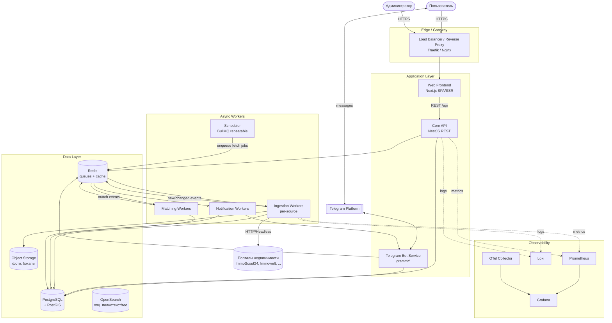
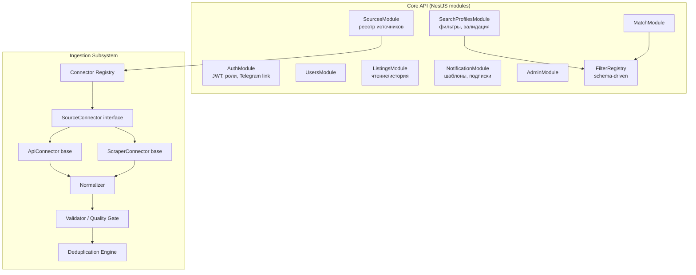
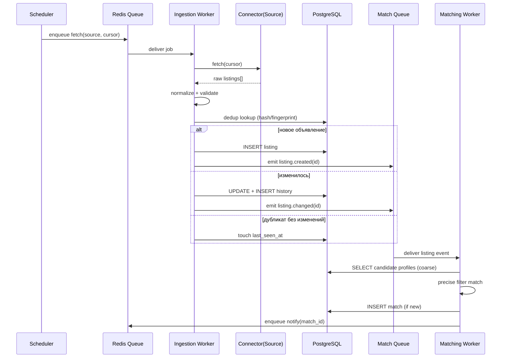
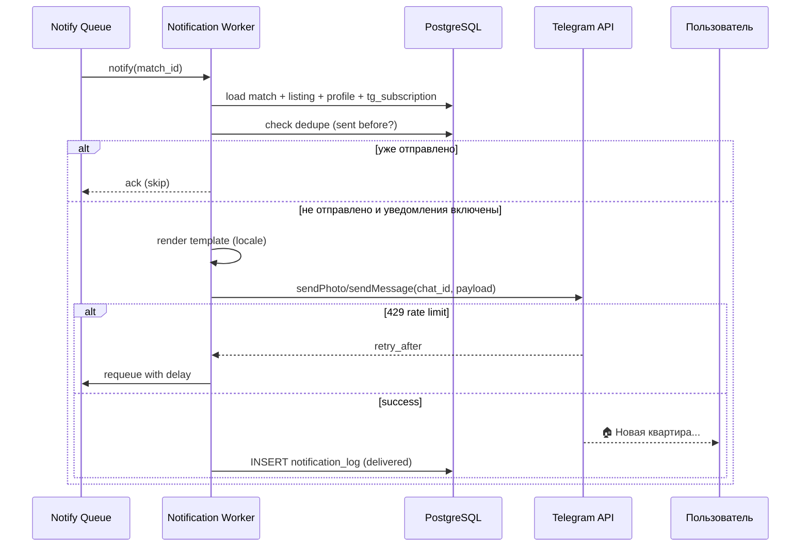

# 5. System Architecture

## 5.1 Архитектурный стиль

Система построена как **модульный сервис‑ориентированный монолит на старте, эволюционирующий в набор сервисов** (modular monolith → services). Это сознательный компромисс:

- На Этапе 1–2 команда мала, источников немного → **модульный монолит** даёт скорость разработки, простоту деплоя и отладки.
- Тяжёлая и непредсказуемая по нагрузке часть (сбор данных) **с самого начала вынесена в отдельные воркеры**, связанные с ядром через очередь задач. Это даёт независимое масштабирование самой «дорогой» части без преждевременного дробления всего на микросервисы.
- Границы модулей (auth, profiles, ingestion, matching, notifications, admin) спроектированы так, что любой модуль можно выделить в отдельный сервис без переписывания (чистые интерфейсы, общение через очередь/события).

> **ADR-001:** Modular Monolith + асинхронные воркеры вместо «полных» микросервисов на старте — минимизирует операционную сложность при сохранении пути к масштабированию.

## 5.2 Высокоуровневая архитектура (C4 — Context / Container)

## 5.3 Логические модули ядра (Component View)

## 5.4 Поток данных (Data Flow, end-to-end)

```mermaid
flowchart LR
    A[Scheduler tick] --> B{Источник активен?}
    B -- да --> C[Enqueue fetch job<br/>source=X, page=N]
    C --> D[Ingestion Worker]
    D --> E[Connector.fetch<br/>API или Scrape]
    E --> F[Raw items]
    F --> G[Normalizer → Listing model]
    G --> H[Validator / Quality Gate]
    H -- invalid --> H2[Drop + log + metric]
    H -- valid --> I[Dedup Engine]
    I -- duplicate --> J[Update existing + history]
    I -- new --> K[Insert Listing]
    K --> L[Emit listing.created]
    J -- significant change --> L2[Emit listing.changed]
    L --> M[Matching Worker]
    L2 --> M
    M --> N[Кандидаты профилей<br/>грубый префильтр]
    N --> O[Точный матч по фильтрам]
    O -- match & not notified --> P[Create Match + enqueue notify]
    P --> Q[Notification Worker]
    Q --> R[Render шаблон]
    R --> S[Telegram sendMessage]
    S --> T[Записать delivery + dedupe key]
```

## 5.5 Sequence — поиск/сбор и матчинг

## 5.6 Sequence — обработка уведомления

## 5.7 Окружения (Environments)

| Окружение | Назначение | Данные | Источники |
|-----------|-----------|--------|-----------|
| **Development** | Локальная разработка | Сиды + mock source | Mock connector |
| **Staging** | Предпрод, интеграционные тесты | Анонимизированные | Реальные источники в «сухом» режиме (без отправки в Telegram, либо тестовый бот) |
| **Production** | Боевая | Реальные | Все включённые |

## 5.8 Ключевые архитектурные принципы

1. **Async-first**: всё, что обращается к внешнему миру (источники, Telegram), идёт через очереди → устойчивость к сбоям и всплескам.
2. **Plugin isolation**: каждый источник — изолированный плагин с собственным контрактом, конфигом и лимитами.
3. **Schema-driven filters**: фильтры декларативны, добавление нового не требует правки матчинга (см. раздел 10).
4. **Idempotency everywhere**: ключи дедупликации на уровне объявлений и уведомлений.
5. **Observability by default**: метрики/логи/трейсы встроены в каждый компонент.
6. **Stateless app tier**: всё состояние — в PostgreSQL/Redis/S3.
