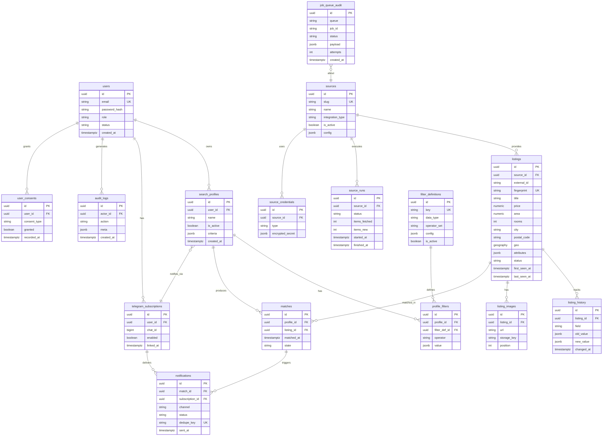

# 7. Database Design

СУБД: **PostgreSQL 16 + PostGIS**. Все таблицы используют `UUID` (v7, time‑ordered) как PK для дружественности к шардированию и распределённой генерации.

## 7.1 ERD



## 7.2 Описание таблиц

### users
Учётные записи. PII (email) шифруется на уровне приложения/диска; пароль — Argon2id. `role ∈ {user, premium, admin, super_admin}`, `status ∈ {pending, active, suspended, deleted}`. Поле `deleted_at` для soft-delete + GDPR‑анонимизация.

### search_profiles
Поисковые профили пользователя. `criteria` (JSONB) — денормализованный снимок фильтров для быстрого матчинга; нормализованная форма — в `profile_filters`. `is_active` управляет участием в матчинге.

### filter_definitions
**Реестр фильтров** (schema-driven). Каждый поддерживаемый фильтр описан декларативно: `key` (`price`, `rooms`, `balcony`, ...), `data_type` (`number`/`bool`/`enum`/`geo`/`range`), `operator_set` (`gte,lte,eq,in,within`), `config` (единицы, допустимые значения, UI‑метаданные). **Новый фильтр = новая строка**, без изменения кода (см. раздел 9/10).

### profile_filters
Связка профиль↔фильтр со `operator` и `value` (JSONB). Позволяет произвольные комбинации без ALTER TABLE.

### sources
Реестр источников. `integration_type ∈ {api, scrape}`. `config` (JSONB) — параметры коннектора (base_url, селекторы/маппинг полей, лимиты, расписание). `is_active` + circuit‑breaker состояние.

### source_credentials
Секреты источника (API‑ключи, токены, куки) — `encrypted_secret` (JSONB, шифрование envelope через KMS/Vault). Никогда не отдаётся в API в открытом виде.

### listings
Нормализованные объявления. `external_id` — id у источника; `fingerprint` — хэш для дедупликации (см. 7.5). `geo` (PostGIS geography) — для радиусного поиска. `attributes` (JSONB) — все опциональные параметры (балкон, лифт, provisionfrei...). `status ∈ {active, updated, expired, removed}`. Пара `(source_id, external_id)` уникальна.

### listing_history
Аудит изменений объявления (цена, статус, площадь). Питает аналитику «история цены» и определение «значимого изменения» для повторного уведомления.

### listing_images
Изображения объявления; оригинал кэшируется в S3 (`storage_key`) во избежание битых ссылок и хотлинка.

### matches
Факт совпадения профиля и объявления. Уникальность `(profile_id, listing_id)` гарантирует, что один профиль матчится с объявлением один раз. `state ∈ {pending, notified, dismissed}`.

### telegram_subscriptions
Связь пользователя с Telegram chat_id. `enabled` — глобальный тумблер уведомлений пользователя. Профильные тумблеры — в `search_profiles.is_active` / отдельном поле.

### notifications
Журнал доставки. `dedupe_key` (например `sha256(profile_id|listing_id|channel)`) гарантирует «только уникальные» уведомления. `status ∈ {queued, sent, failed, skipped}`.

### source_runs
Каждый цикл сбора источника: метрики (fetched/new/updated/errors), статус, длительность — основа мониторинга парсеров.

### user_consents / audit_logs / job_queue_audit
GDPR‑согласия (журнал), аудит действий админов (immutable), и аудит задач очередей для трассировки (дополняет Redis, который эфемерен).

## 7.3 SQL‑схема (DDL, выдержка)

```sql
CREATE EXTENSION IF NOT EXISTS postgis;
CREATE EXTENSION IF NOT EXISTS pg_trgm;
CREATE EXTENSION IF NOT EXISTS "uuid-ossp";

-- USERS ----------------------------------------------------------
CREATE TYPE user_role   AS ENUM ('user','premium','admin','super_admin');
CREATE TYPE user_status AS ENUM ('pending','active','suspended','deleted');

CREATE TABLE users (
    id             UUID PRIMARY KEY DEFAULT gen_random_uuid(),
    email          CITEXT NOT NULL,
    password_hash  TEXT NOT NULL,
    role           user_role   NOT NULL DEFAULT 'user',
    status         user_status NOT NULL DEFAULT 'pending',
    locale         TEXT NOT NULL DEFAULT 'de',
    email_verified_at TIMESTAMPTZ,
    last_login_at  TIMESTAMPTZ,
    deleted_at     TIMESTAMPTZ,
    created_at     TIMESTAMPTZ NOT NULL DEFAULT now(),
    updated_at     TIMESTAMPTZ NOT NULL DEFAULT now()
);
CREATE UNIQUE INDEX uq_users_email ON users (email) WHERE deleted_at IS NULL;

-- SOURCES --------------------------------------------------------
CREATE TYPE integration_type AS ENUM ('api','scrape');

CREATE TABLE sources (
    id               UUID PRIMARY KEY DEFAULT gen_random_uuid(),
    slug             TEXT NOT NULL UNIQUE,
    name             TEXT NOT NULL,
    integration_type integration_type NOT NULL,
    is_active        BOOLEAN NOT NULL DEFAULT false,
    schedule_cron    TEXT NOT NULL DEFAULT '*/15 * * * *',
    rate_limit_rpm   INT NOT NULL DEFAULT 30,
    breaker_state    TEXT NOT NULL DEFAULT 'closed', -- closed|open|half_open
    config           JSONB NOT NULL DEFAULT '{}',
    created_at       TIMESTAMPTZ NOT NULL DEFAULT now(),
    updated_at       TIMESTAMPTZ NOT NULL DEFAULT now()
);

CREATE TABLE source_credentials (
    id               UUID PRIMARY KEY DEFAULT gen_random_uuid(),
    source_id        UUID NOT NULL REFERENCES sources(id) ON DELETE CASCADE,
    type             TEXT NOT NULL, -- api_key|oauth|cookie|basic
    encrypted_secret JSONB NOT NULL,
    created_at       TIMESTAMPTZ NOT NULL DEFAULT now()
);

-- LISTINGS -------------------------------------------------------
CREATE TYPE listing_status AS ENUM ('active','updated','expired','removed');

CREATE TABLE listings (
    id            UUID PRIMARY KEY DEFAULT gen_random_uuid(),
    source_id     UUID NOT NULL REFERENCES sources(id),
    external_id   TEXT NOT NULL,
    fingerprint   TEXT NOT NULL,
    url           TEXT NOT NULL,
    title         TEXT,
    price         NUMERIC(10,2),
    warm_rent     NUMERIC(10,2),
    area          NUMERIC(7,2),
    rooms         NUMERIC(4,1),
    city          TEXT,
    bundesland    TEXT,
    postal_code   TEXT,
    geo           GEOGRAPHY(Point, 4326),
    attributes    JSONB NOT NULL DEFAULT '{}', -- balcony, elevator, provisionfrei...
    status        listing_status NOT NULL DEFAULT 'active',
    first_seen_at TIMESTAMPTZ NOT NULL DEFAULT now(),
    last_seen_at  TIMESTAMPTZ NOT NULL DEFAULT now(),
    raw           JSONB,
    CONSTRAINT uq_source_external UNIQUE (source_id, external_id),
    CONSTRAINT uq_fingerprint     UNIQUE (fingerprint)
);

CREATE TABLE listing_history (
    id          UUID PRIMARY KEY DEFAULT gen_random_uuid(),
    listing_id  UUID NOT NULL REFERENCES listings(id) ON DELETE CASCADE,
    field       TEXT NOT NULL,
    old_value   JSONB,
    new_value   JSONB,
    changed_at  TIMESTAMPTZ NOT NULL DEFAULT now()
);

CREATE TABLE listing_images (
    id          UUID PRIMARY KEY DEFAULT gen_random_uuid(),
    listing_id  UUID NOT NULL REFERENCES listings(id) ON DELETE CASCADE,
    url         TEXT NOT NULL,
    storage_key TEXT,
    position    INT NOT NULL DEFAULT 0
);

-- FILTERS (schema-driven) ---------------------------------------
CREATE TABLE filter_definitions (
    id           UUID PRIMARY KEY DEFAULT gen_random_uuid(),
    key          TEXT NOT NULL UNIQUE,        -- price, rooms, balcony...
    label        JSONB NOT NULL,              -- {de:..., en:..., ru:...}
    data_type    TEXT NOT NULL,               -- number|bool|enum|range|geo
    operator_set TEXT[] NOT NULL,             -- {gte,lte,eq,in,within}
    config       JSONB NOT NULL DEFAULT '{}', -- unit, enum values, ui
    is_active    BOOLEAN NOT NULL DEFAULT true,
    created_at   TIMESTAMPTZ NOT NULL DEFAULT now()
);

-- SEARCH PROFILES -----------------------------------------------
CREATE TABLE search_profiles (
    id          UUID PRIMARY KEY DEFAULT gen_random_uuid(),
    user_id     UUID NOT NULL REFERENCES users(id) ON DELETE CASCADE,
    name        TEXT NOT NULL,
    is_active   BOOLEAN NOT NULL DEFAULT true,
    notify      BOOLEAN NOT NULL DEFAULT true,
    criteria    JSONB NOT NULL DEFAULT '{}',  -- денормализованный снимок
    created_at  TIMESTAMPTZ NOT NULL DEFAULT now(),
    updated_at  TIMESTAMPTZ NOT NULL DEFAULT now()
);

CREATE TABLE profile_filters (
    id            UUID PRIMARY KEY DEFAULT gen_random_uuid(),
    profile_id    UUID NOT NULL REFERENCES search_profiles(id) ON DELETE CASCADE,
    filter_def_id UUID NOT NULL REFERENCES filter_definitions(id),
    operator      TEXT NOT NULL,
    value         JSONB NOT NULL
);

-- MATCHES & NOTIFICATIONS ---------------------------------------
CREATE TABLE matches (
    id          UUID PRIMARY KEY DEFAULT gen_random_uuid(),
    profile_id  UUID NOT NULL REFERENCES search_profiles(id) ON DELETE CASCADE,
    listing_id  UUID NOT NULL REFERENCES listings(id) ON DELETE CASCADE,
    state       TEXT NOT NULL DEFAULT 'pending', -- pending|notified|dismissed
    matched_at  TIMESTAMPTZ NOT NULL DEFAULT now(),
    CONSTRAINT uq_profile_listing UNIQUE (profile_id, listing_id)
);

CREATE TABLE telegram_subscriptions (
    id         UUID PRIMARY KEY DEFAULT gen_random_uuid(),
    user_id    UUID NOT NULL REFERENCES users(id) ON DELETE CASCADE,
    chat_id    BIGINT NOT NULL,
    enabled    BOOLEAN NOT NULL DEFAULT true,
    linked_at  TIMESTAMPTZ NOT NULL DEFAULT now(),
    CONSTRAINT uq_user_chat UNIQUE (user_id, chat_id)
);

CREATE TABLE notifications (
    id              UUID PRIMARY KEY DEFAULT gen_random_uuid(),
    match_id        UUID NOT NULL REFERENCES matches(id) ON DELETE CASCADE,
    subscription_id UUID NOT NULL REFERENCES telegram_subscriptions(id),
    channel         TEXT NOT NULL DEFAULT 'telegram',
    status          TEXT NOT NULL DEFAULT 'queued',
    dedupe_key      TEXT NOT NULL UNIQUE,
    error           TEXT,
    sent_at         TIMESTAMPTZ,
    created_at      TIMESTAMPTZ NOT NULL DEFAULT now()
);

-- OPERATIONS -----------------------------------------------------
CREATE TABLE source_runs (
    id            UUID PRIMARY KEY DEFAULT gen_random_uuid(),
    source_id     UUID NOT NULL REFERENCES sources(id) ON DELETE CASCADE,
    status        TEXT NOT NULL, -- running|success|partial|failed
    items_fetched INT DEFAULT 0,
    items_new     INT DEFAULT 0,
    items_updated INT DEFAULT 0,
    errors        INT DEFAULT 0,
    started_at    TIMESTAMPTZ NOT NULL DEFAULT now(),
    finished_at   TIMESTAMPTZ
);

CREATE TABLE user_consents (
    id           UUID PRIMARY KEY DEFAULT gen_random_uuid(),
    user_id      UUID NOT NULL REFERENCES users(id) ON DELETE CASCADE,
    consent_type TEXT NOT NULL, -- tos, privacy, marketing
    granted      BOOLEAN NOT NULL,
    recorded_at  TIMESTAMPTZ NOT NULL DEFAULT now(),
    ip_hash      TEXT
);

CREATE TABLE audit_logs (
    id         UUID PRIMARY KEY DEFAULT gen_random_uuid(),
    actor_id   UUID REFERENCES users(id),
    action     TEXT NOT NULL,
    meta       JSONB NOT NULL DEFAULT '{}',
    created_at TIMESTAMPTZ NOT NULL DEFAULT now()
);

CREATE TABLE job_queue_audit (
    id         UUID PRIMARY KEY DEFAULT gen_random_uuid(),
    queue      TEXT NOT NULL,
    job_id     TEXT NOT NULL,
    source_id  UUID REFERENCES sources(id),
    status     TEXT NOT NULL,
    attempts   INT DEFAULT 0,
    payload    JSONB,
    created_at TIMESTAMPTZ NOT NULL DEFAULT now()
);
```

## 7.4 Индексы

```sql
-- Гео‑поиск по радиусу
CREATE INDEX idx_listings_geo       ON listings USING GIST (geo);
-- Частые фильтры матчинга
CREATE INDEX idx_listings_city      ON listings (city);
CREATE INDEX idx_listings_postal    ON listings (postal_code);
CREATE INDEX idx_listings_price     ON listings (price);
CREATE INDEX idx_listings_rooms     ON listings (rooms);
CREATE INDEX idx_listings_status_seen ON listings (status, last_seen_at);
-- JSONB атрибуты (булевы признаки)
CREATE INDEX idx_listings_attrs     ON listings USING GIN (attributes);
-- Полнотекст по заголовку/городу
CREATE INDEX idx_listings_title_trgm ON listings USING GIN (title gin_trgm_ops);
-- Матчинг: быстрый поиск активных профилей
CREATE INDEX idx_profiles_active    ON search_profiles (is_active) WHERE is_active;
CREATE INDEX idx_profiles_criteria  ON search_profiles USING GIN (criteria);
-- Дедупликация уведомлений
CREATE INDEX idx_notif_status       ON notifications (status, created_at);
-- Операционные
CREATE INDEX idx_source_runs_src    ON source_runs (source_id, started_at DESC);
CREATE INDEX idx_history_listing    ON listing_history (listing_id, changed_at DESC);
CREATE INDEX idx_matches_profile    ON matches (profile_id, matched_at DESC);
```

## 7.5 Дедупликация — fingerprint

```
fingerprint = sha256( normalize(
    source_slug + '|' +
    coalesce(external_id, street+postal+area+rooms+price)
))
```

- Если у источника стабильный `external_id` → используется он (плюс `source_id`).
- Кросс‑источниковая дедупликация (одна квартира на двух порталах): дополнительный «soft fingerprint» по нормализованным `postal_code + area(±2 м²) + rooms + price(±50€) + geo(±50 м)`; кандидаты схлопываются в логическую группу через таблицу `listing_groups` (вводится на Этапе 3).

## 7.6 Партиционирование и ретеншн

- `listing_history`, `notifications`, `audit_logs`, `job_queue_audit` — **партиционирование по месяцам** (`PARTITION BY RANGE (created_at)`), авто‑создание партиций (pg_partman).
- Ретеншн: `removed` объявления архивируются через 90 дней; `job_queue_audit` хранится 30 дней.
- `listings` при росте > 10 млн → партиционирование по `source_id` или hash.

## 7.7 Стратегия миграций

- **Prisma Migrate** — версионированные миграции в Git, применяются в CI перед деплоем.
- Только обратносовместимые изменения в одном релизе (expand → migrate → contract), чтобы избегать даунтайма.
- Сиды: базовый набор `filter_definitions`, demo‑source (mock) для dev.
