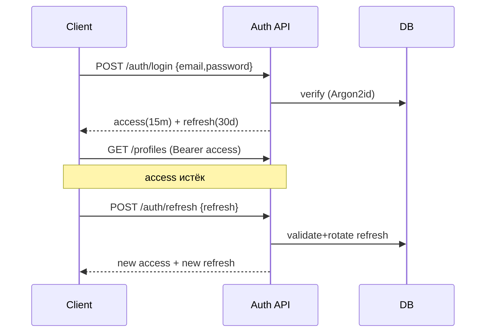

# 8. API Specification

## 8.1 REST vs GraphQL — обоснование выбора

**Выбор: REST (OpenAPI 3.1).**

| Критерий | REST | GraphQL |
|----------|------|---------|
| Сложность модели данных | Простая, ресурсно‑ориентированная | Граф со множеством связей |
| Кэширование (HTTP/CDN) | Нативное | Требует доп. слой |
| Rate limiting / безопасность | Просто по эндпоинтам | Сложнее (глубина/стоимость запроса) |
| Кривая входа команды | Низкая | Выше |
| Реальные потребности UI | Предсказуемые экраны | Не требует гибких графовых выборок |

Модель данных проста и ресурсная (users, profiles, listings, matches), клиент один (наш Next.js), нужны HTTP‑кэш и простой rate‑limit. GraphQL добавил бы сложность без выгоды. **REST + OpenAPI** даёт авто‑генерацию клиента/доков и контрактные тесты.

> **ADR-002:** REST(OpenAPI). GraphQL пересмотреть, если появятся сторонние интеграторы с разнородными потребностями выборки.

## 8.2 Общие соглашения

- Базовый URL: `https://api.suchewohnung.de`
- **Версионирование:** префикс пути `/api/v1`. Несовместимые изменения → `/v2`. Внутри версии — только аддитивные изменения. Депрекация через заголовок `Deprecation` + `Sunset`.
- Формат: `application/json`, поля `snake_case`.
- Даты: ISO‑8601 UTC.
- Пагинация: cursor‑based (`?limit=&cursor=`), ответ `{ data, page: { next_cursor, has_more } }`.
- Идемпотентность мутаций: заголовок `Idempotency-Key`.
- Корреляция: `X-Request-Id` (генерируется/прокидывается в трейсы).

## 8.3 Аутентификация

- **JWT RS256.** `POST /auth/login` → `access_token` (15 мин) + `refresh_token` (30 дней, хранится hashed в БД, ротация при использовании).
- Заголовок: `Authorization: Bearer <access_token>`.
- Роли через claim `role`; защита эндпоинтов RBAC‑guard.
- Telegram‑привязка через одноразовый deep‑link токен (`/auth/telegram/link`).



## 8.4 Коды ошибок

Единый формат:
```json
{ "error": { "code": "VALIDATION_ERROR", "message": "...", "details": [{ "field": "price_max", "issue": "must be > price_min" }], "request_id": "..." } }
```

| HTTP | code | Когда |
|------|------|-------|
| 400 | VALIDATION_ERROR | Невалидные параметры |
| 401 | UNAUTHENTICATED | Нет/протух токен |
| 403 | FORBIDDEN | Нет прав (RBAC) |
| 404 | NOT_FOUND | Ресурс не найден |
| 409 | CONFLICT | Дубликат (email/профиль) |
| 422 | UNPROCESSABLE | Семантически неверно |
| 429 | RATE_LIMITED | Превышен лимит (заголовок `Retry-After`) |
| 500 | INTERNAL | Необработанная ошибка |
| 503 | SERVICE_UNAVAILABLE | Зависимость недоступна |

## 8.5 Эндпоинты

### Auth
| Метод | Путь | Описание |
|-------|------|----------|
| POST | `/api/v1/auth/register` | Регистрация |
| POST | `/api/v1/auth/verify-email` | Подтверждение email |
| POST | `/api/v1/auth/login` | Логин |
| POST | `/api/v1/auth/refresh` | Обновление токена |
| POST | `/api/v1/auth/logout` | Отзыв refresh |
| POST | `/api/v1/auth/password/reset-request` | Запрос сброса |
| POST | `/api/v1/auth/password/reset` | Сброс по токену |
| POST | `/api/v1/auth/telegram/link` | Получить deep‑link для привязки TG |

### Users (self)
| Метод | Путь | Описание |
|-------|------|----------|
| GET | `/api/v1/me` | Профиль аккаунта |
| PATCH | `/api/v1/me` | Обновить (locale, имя) |
| DELETE | `/api/v1/me` | GDPR‑удаление (анонимизация) |
| GET | `/api/v1/me/export` | GDPR‑экспорт данных (JSON) |
| GET | `/api/v1/me/consents` / PUT | Управление согласиями |

### Search Profiles
| Метод | Путь | Описание |
|-------|------|----------|
| GET | `/api/v1/profiles` | Список профилей |
| POST | `/api/v1/profiles` | Создать |
| GET | `/api/v1/profiles/:id` | Детали |
| PATCH | `/api/v1/profiles/:id` | Изменить (фильтры, имя) |
| DELETE | `/api/v1/profiles/:id` | Удалить |
| POST | `/api/v1/profiles/:id/toggle` | Вкл/выкл уведомления |
| GET | `/api/v1/profiles/:id/matches` | Совпадения профиля |

### Filters (metadata, schema-driven)
| Метод | Путь | Описание |
|-------|------|----------|
| GET | `/api/v1/filters` | Доступные фильтры (для динамической формы UI) |

### Listings
| Метод | Путь | Описание |
|-------|------|----------|
| GET | `/api/v1/listings` | Поиск с query‑фильтрами + пагинация |
| GET | `/api/v1/listings/:id` | Детали |
| GET | `/api/v1/listings/:id/history` | История изменений/цены |

### Notifications
| Метод | Путь | Описание |
|-------|------|----------|
| GET | `/api/v1/notifications` | История уведомлений |
| POST | `/api/v1/notifications/test` | Тестовое уведомление в TG |

### Admin (`/api/v1/admin`, роль admin+)
| Метод | Путь | Описание |
|-------|------|----------|
| GET/PATCH | `/admin/users` `/admin/users/:id` | Управление пользователями |
| GET/POST/PATCH | `/admin/sources` ... | CRUD источников |
| POST | `/admin/sources/:id/run` | Ручной запуск сбора |
| POST | `/admin/sources/:id/toggle` | Вкл/выкл источник |
| GET | `/admin/sources/:id/runs` | История прогонов |
| GET | `/admin/queues` | Состояние очередей (длины, DLQ) |
| POST | `/admin/queues/:name/retry` | Перезапуск задач из DLQ |
| GET | `/admin/logs` | Поиск по логам |
| GET | `/admin/stats` | Системная статистика |
| GET/POST | `/admin/filters` | Управление реестром фильтров |

### Webhooks
| Метод | Путь | Описание |
|-------|------|----------|
| POST | `/api/v1/telegram/webhook` | Входящие апдейты Telegram (secret token) |

## 8.6 Примеры

**Создание профиля:**
```http
POST /api/v1/profiles
Authorization: Bearer <token>
Content-Type: application/json

{
  "name": "Berlin 2-Zi bis 1300€",
  "notify": true,
  "filters": [
    { "key": "city",         "operator": "eq",     "value": "Berlin" },
    { "key": "price",        "operator": "lte",    "value": 1300 },
    { "key": "rooms",        "operator": "gte",    "value": 2 },
    { "key": "area",         "operator": "gte",    "value": 55 },
    { "key": "balcony",      "operator": "eq",     "value": true },
    { "key": "provisionfrei","operator": "eq",     "value": true },
    { "key": "location",     "operator": "within", "value": { "lat": 52.52, "lng": 13.405, "radius_km": 5 } }
  ]
}
```
**Ответ `201`:**
```json
{
  "data": {
    "id": "0190f...",
    "name": "Berlin 2-Zi bis 1300€",
    "is_active": true,
    "notify": true,
    "filters": [ ... ],
    "created_at": "2026-05-31T10:00:00Z"
  }
}
```

**Поиск объявлений:**
```http
GET /api/v1/listings?city=Berlin&price_max=1300&rooms_min=2&balcony=true&limit=20
```

## 8.7 Rate limiting

- Публичные эндпоинты: 60 req/min/IP.
- Авторизованные: 600 req/min/пользователь.
- Заголовки `X-RateLimit-Limit/Remaining/Reset`; реализация — Redis sliding window в Traefik/Nest guard.

## 8.8 Контракт и документация

- OpenAPI 3.1 генерируется из NestJS‑декораторов (`@nestjs/swagger`), Swagger UI на `/api/docs`.
- Контрактные тесты (Dredd/schemathesis) в CI.
- Авто‑генерация типизированного клиента для фронтенда (`openapi-typescript`).
