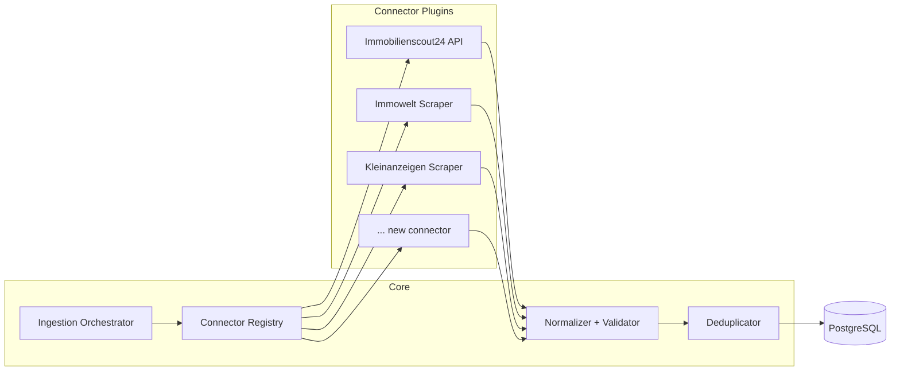
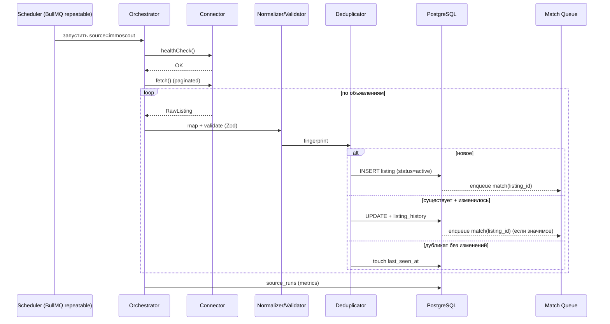

# 9. Integration Architecture (Plugin / Connector System)

Цель: подключать **десятки источников** без изменения ядра. Достигается через **plugin‑архитектуру коннекторов** с единым контрактом.

## 9.1 Принцип

Каждый источник = **Connector‑плагин**, реализующий общий интерфейс. Ядро (Ingestion Orchestrator) не знает деталей источников — оно работает только с интерфейсом и метаданными из таблицы `sources`. Добавление источника = новый класс‑плагин + строка в `sources` + (опц.) секреты. **Ноль изменений в ядре, остальных коннекторах, БД‑схеме.**



## 9.2 Контракт коннектора

```ts
export interface SourceConnector {
  /** уникальный slug, совпадает с sources.slug */
  readonly slug: string;
  readonly type: 'api' | 'scrape';

  /** проверка доступности/учёток перед прогоном */
  healthCheck(ctx: ConnectorContext): Promise<HealthStatus>;

  /** основной метод: вернуть «сырые» объявления страницами/потоком */
  fetch(ctx: ConnectorContext, opts: FetchOptions): AsyncIterable<RawListing>;

  /** преобразование сырого объекта в нормализованную модель */
  map(raw: RawListing): NormalizedListing;
}

export interface ConnectorContext {
  config: Record<string, unknown>;   // sources.config
  credentials?: DecryptedCredentials; // из source_credentials
  http: HttpClient;                   // с прокси/ретраями/лимитом
  browser: BrowserPool;               // Playwright (lazy)
  logger: Logger;
  signal: AbortSignal;
}
```

- **`RawListing`** — произвольная форма источника (`raw` сохраняется в `listings.raw`).
- **`NormalizedListing`** — строго типизирован Zod‑схемой ядра (общие поля + `attributes`).
- Регистрация: декоратор `@RegisterConnector()` + автоскан папки `connectors/` (или явный массив в DI‑модуле).

## 9.3 Жизненный цикл прогона (pipeline)



## 9.4 Вариант 1 — интеграция через API

Шаги, описанные в требованиях, реализуются базовым классом `ApiConnector`:

- **Авторизация:** стратегии `api_key` (header/query), `oauth2` (client credentials/refresh), `basic`. Секреты — из `source_credentials` (envelope‑шифрование). Токены кэшируются в Redis с TTL, авто‑refresh.
- **Получение объявлений:** пагинация (cursor/offset/page), инкрементальный режим (`updated_since`), маппинг полей задаётся в `sources.config.field_map` (JSONata‑выражения) — часто новый API‑источник = только конфиг.
- **Лимиты запросов:** per‑source `rate_limit_rpm` через BullMQ rate‑limiter + token‑bucket в Redis; уважение заголовков `Retry-After`, `X-RateLimit-*`.
- **Обработка ошибок:** классификация (retryable 5xx/429/timeout vs fatal 4xx); экспоненциальный backoff с jitter; **circuit breaker** (`sources.breaker_state`); fatal → алерт + пометка прогона `partial/failed`.

## 9.5 Вариант 2 — интеграция через Web Scraping

Базовый класс `ScrapeConnector` со стратегией **«cheap path first»**:

1. **HTTP + Cheerio** (без браузера) — если контент в статическом HTML/встроенном JSON (`__NEXT_DATA__`, `application/ld+json`). Самый дешёвый путь.
2. **Перехват XHR/JSON через Playwright** — если SPA дёргает внутренний API: открываем страницу, ловим `response`‑события, берём JSON напрямую (минуя парсинг DOM).
3. **Полный рендер DOM через Playwright** — крайний случай: ждём селекторы, скроллим (lazy‑load), кликаем пагинацию/«показать ещё».

Покрытие требований:
- **Автоматический обход сайта:** карта обхода в `config` (страницы списка, пагинация, правила перехода на карточку); поддержка sitemap.xml.
- **Чтение HTML / извлечение данных:** декларативные селекторы/маппинг в `config.selectors` (CSS/XPath/JSONata) → новый сайт зачастую = только конфиг + селекторы, без нового кода.
- **JS‑страницы / динамический контент:** Playwright‑pool с `waitForSelector`, перехват сети, эмуляция скролла.
- **Защита от блокировок:**
  - Пул резидентных/датацентровых **прокси** с ротацией, гео‑привязка к DE.
  - Ротация реалистичных `User-Agent` и заголовков, реальные viewport/locale (`de-DE`).
  - Рандомизированные задержки, ограничение RPS, «вежливый» режим.
  - Stealth‑патчи Playwright (маскировка webdriver‑признаков).
  - Сессии/куки на источник, разогрев сессии.
  - Решение CAPTCHA — через внешний сервис (опц., с осторожностью к легальности).
  - Детект блокировки (HTTP 403/429, признаки challenge) → пауза, смена прокси/UA, circuit breaker.

> **Юридическая оговорка:** скрейпинг ведётся с уважением robots.txt и ToS источника; при наличии официального API он приоритетен. Решения по конкретным источникам фиксируются в `docs/legal/` (см. Risk Analysis).

## 9.6 Планировщик обновлений

- **BullMQ repeatable jobs**: на каждый активный источник — cron из `sources.schedule_cron` (например `*/15 * * * *`).
- **Adaptive scheduling:** частые источники с высоким притоком новых объявлений опрашиваются чаще; «тихие» — реже (на основе метрик `source_runs.items_new`).
- **Защита от наложения:** один активный прогон на источник (job‑lock в Redis), пропуск/очередизация при перекрытии.
- **Backfill** при первом подключении: исторический проход с пониженным RPS.

## 9.7 Добавление нового источника — чек‑лист

```
1. Создать connectors/<slug>/<Slug>Connector.ts (extends ApiConnector|ScrapeConnector)
2. Описать map()/selectors/field_map (часто только конфиг)
3. Юнит‑тест map() на зафиксированных фикстурах (recorded HTML/JSON)
4. INSERT в sources (+ source_credentials при необходимости)
5. healthCheck() зелёный → включить is_active в админке
6. Прогнать в staging, проверить качество данных и дедуп
7. Включить в production, наблюдать дашборд source_runs
```

Никаких изменений в ядре, БД‑схеме, API или других коннекторах — это и есть масштабирование до десятков источников.

## 9.8 Проверка качества данных (Этап 2)

Перед записью в БД нормализованное объявление проходит **Quality Gate**:
- **Schema‑валидация (Zod):** типы, обязательные поля (url, price|warm_rent, source).
- **Sanity‑правила:** `price ∈ [50, 50000]`, `area ∈ [5, 1000]`, `rooms ∈ [0.5, 20]`, валидный PLZ (5 цифр), гео в границах Германии.
- **Геокодирование:** если нет координат — геокодер (Nominatim/собственный) по адресу+PLZ, результат кэшируется в Redis.
- **Нормализация:** валюта→EUR, единицы→м², trim/очистка текста, маппинг булевых атрибутов.
- **Карантин:** объявления, не прошедшие проверки, помечаются `status=quarantine` и видны в админке (не уведомляются), что даёт сигнал о поломке селекторов источника.
