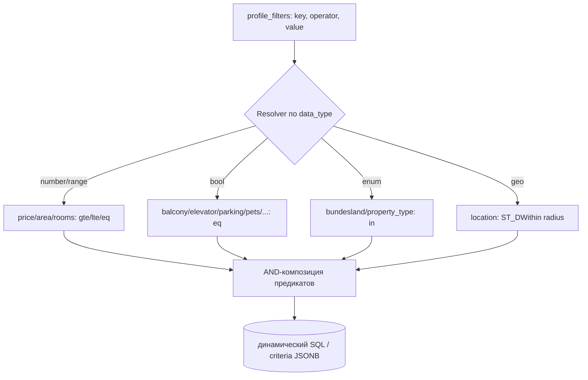

# 10. Search Engine Logic (Matching & Filters)

## 10.1 Обзор

Движок отвечает на вопрос: *«какие активные поисковые профили совпадают с новым/обновлённым объявлением?»* — и наоборот для ручного поиска пользователя. Работает в двух режимах:

1. **Push (inverse matching):** при появлении объявления → найти подходящие профили → создать `matches` → поставить уведомления. Основной путь для real‑time.
2. **Pull (forward search):** пользователь смотрит каталог `GET /listings` с фильтрами → обычный SQL‑запрос.

## 10.2 Schema-driven фильтры (расширяемость без кода)

Фильтр описывается **декларативно** в `filter_definitions`. Движок матчинга — generic: он итерирует `profile_filters`, и для каждого применяет оператор согласно `data_type`. Добавление нового фильтра (например «год постройки») = **INSERT в `filter_definitions`** + (если поле новое) запись в `listings.attributes`. Код матчинга не меняется.



### Поддерживаемые фильтры (сид `filter_definitions`)
| key | data_type | operators | хранение в listings |
|-----|-----------|-----------|---------------------|
| city | enum/text | eq, in | `city` |
| bundesland | enum | eq, in | `bundesland` |
| postal_code | text | eq, in | `postal_code` |
| location (радиус) | geo | within | `geo` |
| price | number | gte, lte | `price` |
| area | number | gte, lte | `area` |
| rooms | number | gte, lte | `rooms` |
| balcony, terrace, elevator, parking, cellar, furnished, pets_allowed, new_building, provisionfrei | bool | eq | `attributes.*` |

## 10.3 Алгоритм inverse matching

При событии «новое/обновлённое объявление» воркер `match` выполняет:

```sql
-- Кандидаты-профили: грубый отбор по денормализованному criteria (JSONB + GIN),
-- затем точная проверка predicate-engine'ом в приложении.
SELECT sp.id, sp.criteria
FROM search_profiles sp
WHERE sp.is_active
  AND (sp.criteria->>'city' IS NULL OR sp.criteria->>'city' = $city)
  AND (sp.criteria->'price'->>'lte' IS NULL OR ($price <= (sp.criteria->'price'->>'lte')::numeric))
  AND (sp.criteria->'price'->>'gte' IS NULL OR ($price >= (sp.criteria->'price'->>'gte')::numeric))
  -- ... аналогично rooms/area ...
  AND ($geo IS NULL OR sp.criteria->'location' IS NULL
       OR ST_DWithin($geo, ST_MakePoint((criteria->'location'->>'lng')::float,
                                         (criteria->'location'->>'lat')::float)::geography,
                     (criteria->'location'->>'radius_km')::float * 1000));
```

Этапы:
1. **Грубый отбор** в SQL по индексируемым полям (дёшево отсекает 99% профилей).
2. **Точная проверка** generic predicate‑engine по полному набору `profile_filters` (включая булевы атрибуты).
3. **Анти‑дубль:** `INSERT INTO matches ... ON CONFLICT (profile_id, listing_id) DO NOTHING` — если уже матчили, уведомление не повторяется.
4. **Постановка уведомления** только для строк, реально вставленных в `matches`, и только если `profile.notify` и подписка `enabled`.

## 10.4 Производительность матчинга

- На старте профилей немного (тысячи) → SQL‑отбор мгновенен.
- При росте до сотен тысяч профилей → переход на **обратный индекс** (Percolator‑подход в OpenSearch / собственный in‑memory rule‑index, сгруппированный по городу/PLZ), без изменения внешнего контракта.
- Гео‑запросы ускоряются GIST‑индексом; булевы — GIN по `attributes`.

## 10.5 Повторное уведомление при изменении

- Снижение цены ниже порога профиля или смена статуса `expired→active` считается «значимым изменением» → допускается **одно** повторное уведомление (с пометкой «📉 Цена снижена»), при этом `dedupe_key` включает версию изменения, чтобы не спамить.

## 10.6 Forward search (каталог)

`GET /listings` строит параметризованный SQL из тех же `filter_definitions` (общий QueryBuilder), что гарантирует идентичную семантику фильтров в каталоге и в матчинге.
