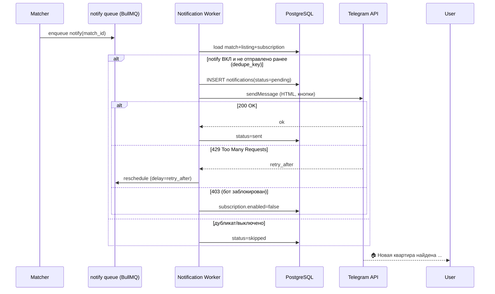

# 11. Telegram Notification System

## 11.1 Архитектура бота

- Библиотека: **grammY** (TypeScript). Режим **webhook** в production (`POST /api/v1/telegram/webhook` с `secret_token`), long‑polling — только для локальной разработки.
- Бот — отдельный модуль/процесс; общается с ядром через БД и очередь `notify`.
- Привязка аккаунта: пользователь в веб‑панели жмёт «Подключить Telegram» → выдаётся deep‑link `https://t.me/SucheWohnungBot?start=<one_time_token>` → бот по `/start <token>` связывает `chat_id` ↔ `user_id` (запись в `telegram_subscriptions`).



## 11.2 Гарантии уникальности

- На уровне БД: `matches` уникален по `(profile_id, listing_id)` → один матч на профиль.
- На уровне доставки: `notifications.dedupe_key = hash(subscription_id, listing_id, change_version)` с UNIQUE‑констрейнтом → даже при ретраях/двойной постановке задачи отправка ровно один раз (idempotent).

## 11.3 Управление подписками (команды бота)

| Команда | Действие |
|---------|----------|
| `/start <token>` | Привязать аккаунт |
| `/profiles` | Список профилей с inline‑кнопками вкл/выкл |
| `/pause` | Глобально выключить все уведомления |
| `/resume` | Включить уведомления |
| `/mute 2h` | Тихий режим на время |
| `/settings` | Язык, частота (моментально/дайджест) |
| `/help` | Справка |
| `/stop` | Отписаться/отвязать |

- Несколько поисковых профилей на пользователя — каждый со своим тумблером уведомлений (`profile.notify`), плюс глобальный тумблер подписки (`subscription.enabled`).
- Inline‑кнопки используют `callback_query` → бот обновляет состояние и редактирует сообщение.

## 11.4 Формат уведомления

HTML‑parse‑mode, шаблон (i18n: de/en/ru):

```
🏠 <b>Новая квартира найдена</b>

📍 {city}{, district}
💰 {price} €{ (+ {warm_rent}€ тепл.)}
📐 {area} м²
🛏 {rooms} комнаты
{🎈 Балкон · 🛗 Лифт · 🅿️ Парковка}   ← только присутствующие
{📉 <b>Цена снижена</b> на {delta}€}    ← при повторном

🔗 <a href="{url}">Ссылка на объявление</a>

Источник: {source_name}
```

Inline‑кнопки: `[🔗 Открыть] [👍 Сохранить] [🔕 Отключить этот профиль]`.
Фото объявления — `sendPhoto` с подписью (если есть `listing_images`).

## 11.5 Rate limiting и батчинг

- Telegram лимиты: ~30 msg/sec глобально, ~1 msg/sec на чат. Воркер уважает их через token‑bucket; per‑chat очередь.
- При «всплеске» (массовый прогон) — режим **дайджеста**: группировка N совпадений за окно (напр. 10 мин) в одно сообщение, настраивается в `/settings`.
- Backoff на `429` по `retry_after`.

## 11.6 Надёжность доставки

- Состояния `notifications`: `pending → sent | failed | skipped`.
- Ретраи с экспоненциальным backoff (до 5 попыток), затем DLQ + видно в админке.
- Блокировка бота пользователем (`403`) → авто‑disable подписки, без бесконечных ретраев.
