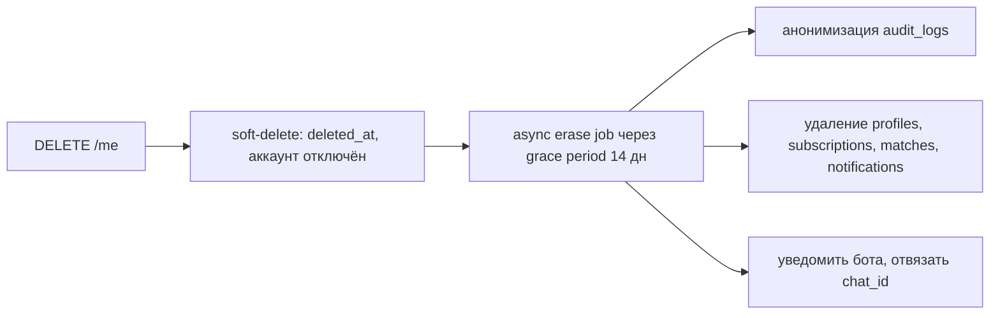

# 13. Security & GDPR Compliance

## 12.1 Аутентификация и авторизация

- **JWT**: короткоживущий access (15 мин) + refresh (30 дн, rotating, хранится в httpOnly+Secure+SameSite=Strict cookie). Подпись RS256, ключи в KMS/секрет‑менеджере, ротация ключей.
- **Хеш паролей**: Argon2id (memory‑hard), per‑user salt.
- **RBAC**: роли `user`, `support`, `admin` (claim в JWT + проверка на сервере). Админ‑эндпоинты — отдельный guard.
- **2FA (TOTP)** для админов — обязательно.
- **Подтверждение email**, защита от перебора (см. ниже).

## 12.2 Защита приложения (OWASP)

| Угроза | Мера |
|--------|------|
| Injection | Параметризованные запросы (Prisma), Zod‑валидация входа |
| XSS | Экранирование, CSP‑заголовки, sanitization пользовательского ввода |
| CSRF | SameSite‑cookie + CSRF‑токен на mutating‑запросах из браузера |
| Brute force | Rate limit на `/auth/*`, экспоненциальная задержка, lockout, CAPTCHA при аномалии |
| Broken access control | Централизованные guards, проверка владения ресурсом (`profile.user_id == jwt.sub`) |
| Secrets | Vault/Secret Manager, никогда в коде/репозитории; `source_credentials` — envelope‑шифрование (AES‑256‑GCM, ключ из KMS) |
| Transport | TLS 1.2+ везде, HSTS |
| Dependencies | `npm audit`, Dependabot/Renovate, SCA в CI |
| Headers | helmet: CSP, X‑Frame‑Options, X‑Content‑Type‑Options |

## 12.3 Сетевой периметр

- Публично доступны только Edge/API Gateway (HTTPS). БД, Redis, воркеры — в приватной сети.
- WAF + rate limiting на gateway. DDoS‑защита на уровне облачного провайдера/CDN.
- Egress скрейперов — через прокси‑пул, изолированный от внутренней сети.

## 12.4 GDPR Compliance

Платформа работает с резидентами ЕС → **GDPR обязателен**.

### Правовые основания и согласия
- **Согласие** на обработку и на уведомления (фиксируется в `user_consents`: тип, версия политики, timestamp, IP).
- Версионируемые **Политика конфиденциальности** и **ToS**; повторный запрос согласия при изменении версии.

### Права субъектов данных
| Право (GDPR) | Реализация |
|--------------|------------|
| Доступ (Art. 15) | `GET /me/export` → выгрузка всех персональных данных (JSON) |
| Переносимость (Art. 20) | Тот же экспорт в машиночитаемом формате |
| Удаление / «право быть забытым» (Art. 17) | `DELETE /me` → soft‑delete + асинхронная полная очистка ПД (см. ниже) |
| Исправление (Art. 16) | Редактирование профиля |
| Отзыв согласия | Кнопка в настройках/`/stop` в боте → стоп обработки |
| Ограничение обработки (Art. 18) | Флаг заморозки аккаунта |

### Минимизация и хранение
- Собираем минимум ПД: email, (опц.) Telegram chat_id, поисковые предпочтения.
- **Retention policy**: неактивные аккаунты > 24 мес → напоминание → удаление. Логи с ПД → 90 дней. Технические логи → 30 дней.
- **Псевдонимизация** в аналитике (хеш user_id).
- **Объявления** — это публичные данные о недвижимости, не ПД пользователей; контакты арендодателей из объявлений не хранятся дольше необходимого и не используются для маркетинга.

### Процесс удаления (erasure)

### Прочее
- **DPA** с под‑процессорами (хостинг, прокси, Telegram, email‑провайдер); реестр под‑процессоров.
- **Data residency**: хостинг в EU‑регионе (Frankfurt).
- **Privacy by design/default**: уведомления opt‑in, телеметрия минимальна.
- **Breach notification**: процедура уведомления надзорного органа в течение 72 ч.
- **Cookie‑consent** на веб‑панели (только необходимые cookie без согласия).
