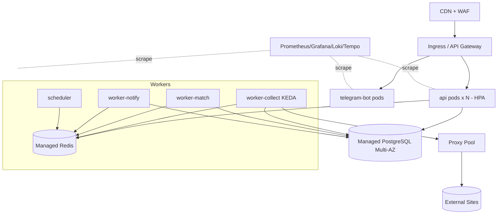
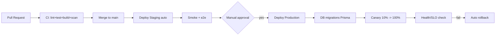

# 14. Deployment Architecture (DevOps)

## 13.1 Контейнеризация (Docker)

Каждый компонент — отдельный образ, multi‑stage build (slim runtime, non‑root user, healthcheck).

Образы: `api`, `worker-collect`, `worker-match`, `worker-notify`, `scheduler`, `telegram-bot`, `web` (фронт, отдаётся через nginx/Edge).

**Пример `Dockerfile` (api):**
```dockerfile
# build
FROM node:22-bookworm-slim AS build
WORKDIR /app
COPY package*.json ./
RUN npm ci
COPY . .
RUN npm run build && npm prune --omit=dev

# runtime
FROM node:22-bookworm-slim AS runtime
ENV NODE_ENV=production
WORKDIR /app
RUN useradd -m app
COPY --from=build /app/node_modules ./node_modules
COPY --from=build /app/dist ./dist
COPY --from=build /app/package.json ./
USER app
EXPOSE 3000
HEALTHCHECK --interval=30s --timeout=3s CMD node dist/healthcheck.js
CMD ["node", "dist/main.js"]
```

## 13.2 Docker Compose (локальная разработка / staging single‑host)

```yaml
version: "3.9"
services:
  postgres:
    image: postgis/postgis:16-3.4
    environment:
      POSTGRES_DB: suchewohnung
      POSTGRES_USER: app
      POSTGRES_PASSWORD: ${DB_PASSWORD}
    volumes: ["pgdata:/var/lib/postgresql/data"]
    healthcheck: { test: ["CMD-SHELL", "pg_isready -U app"], interval: 10s }

  redis:
    image: redis:7-alpine
    command: ["redis-server", "--appendonly", "yes"]
    volumes: ["redisdata:/data"]

  api:
    build: ./services/api
    env_file: .env
    depends_on: [postgres, redis]
    ports: ["3000:3000"]

  worker-collect:
    build: ./services/worker
    command: ["node", "dist/workers/collect.js"]
    env_file: .env
    depends_on: [postgres, redis]
    deploy: { replicas: 2 }

  worker-match:
    build: ./services/worker
    command: ["node", "dist/workers/match.js"]
    env_file: .env
    depends_on: [postgres, redis]

  worker-notify:
    build: ./services/worker
    command: ["node", "dist/workers/notify.js"]
    env_file: .env
    depends_on: [postgres, redis]

  scheduler:
    build: ./services/worker
    command: ["node", "dist/workers/scheduler.js"]
    env_file: .env
    depends_on: [redis]

  telegram-bot:
    build: ./services/bot
    env_file: .env
    depends_on: [postgres, redis]

  web:
    build: ./services/web
    ports: ["8080:80"]

volumes: { pgdata: {}, redisdata: {} }
```

## 13.3 Production: оркестрация

- **Kubernetes** (EKS/GKE или managed EU) для production; Helm‑чарты на компонент.
- HPA (Horizontal Pod Autoscaler) для `api` (по CPU/RPS) и воркеров (по длине очереди — KEDA scaler на BullMQ/Redis).
- Managed **PostgreSQL** (RDS/Cloud SQL, EU‑регион, Multi‑AZ) и managed **Redis**.
- Secrets — через External Secrets + Vault/Cloud Secret Manager.
- Ingress + cert‑manager (Let's Encrypt), WAF на CDN/edge.



## 13.4 Окружения

| Окружение | Назначение | Данные | Деплой |
|-----------|-----------|--------|--------|
| **Development** | Локально (Docker Compose) | Синтетика/фикстуры | Вручную |
| **Staging** | Пред‑прод, e2e, демо | Анонимизированные/тестовые | Авто из `main` |
| **Production** | Боевое | Реальные (EU) | Ручное подтверждение (gated) |

Конфиг через env‑переменные (12‑factor). Никаких различий в коде между окружениями — только конфигурация.

## 13.5 CI/CD

**CI (на каждый PR):** lint → typecheck → unit/integration тесты (testcontainers PG/Redis) → SCA/`npm audit` → build образов → scan образов (Trivy).

**CD:**


- Инструмент: **GitHub Actions** (или GitLab CI). Реестр образов — GHCR/ECR.
- Миграции БД — Prisma Migrate, прогон как отдельный job перед rollout, обратимые миграции.
- Стратегия выката: rolling/canary; авто‑rollback по SLO.

## 13.6 Git Flow

- **Trunk‑based с короткоживущими feature‑ветками** (рекомендуется для скорости): `main` всегда деплоится; ветки `feat/*`, `fix/*` живут < 2 дней; обязательный PR + 1 review + зелёный CI.
- Релизы тегируются семвером (`v1.2.0`); production деплоится по тегу.
- Альтернатива при необходимости фиксированных релизов — классический GitFlow (`develop`/`release/*`/`hotfix/*`); выбран trunk‑based ради непрерывной поставки.
- Conventional Commits → авто‑changelog.

## 13.7 Резервное копирование и DR

- PostgreSQL: автоматические снапшоты (ежедневно) + PITR (WAL‑архив, RPO ≤ 5 мин). Хранение 30 дней.
- Регулярные **restore‑drills** (проверка восстановимости) — ежеквартально.
- Redis: AOF + снапшоты (очереди восстановимы; критичное состояние — в PG).
- Объектное хранилище (изображения/экспорты) — версионирование + cross‑region репликация.
- **RTO ≤ 1 ч, RPO ≤ 5 мин.** Runbook аварийного восстановления в репозитории.
